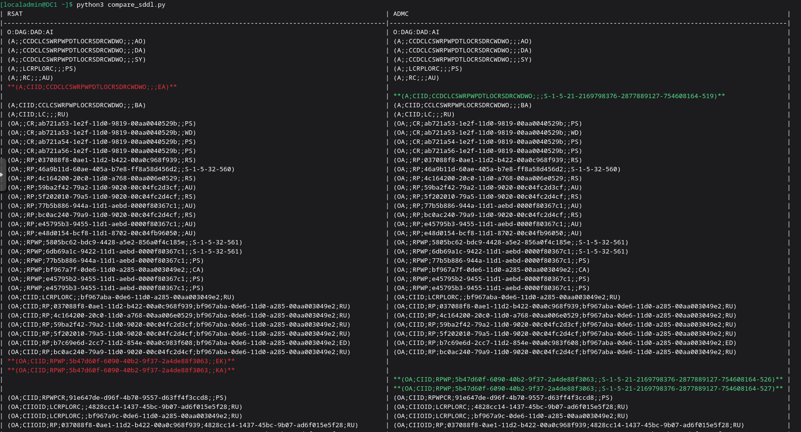

# ad-security-reports
Test Reports for ADMC and RSAT Elevated Privileges

## Задача
Проверить наличие или отсутствие различий в атрибуте учётной записи **ntSecurityDescriptor**
при выставлении анологичных расширенных прав через оснастку **RSAT** и **ADMC**

## Конфигурация доменной инфраструктуры
1) Домен **EXTRA.ALT** на **samba-4.20.8-alt2.x86_64**
2) #118 **ALT Server P11,  DC1** - контроллер домена **EXTRA.ALT**
3) #143 **Windows 10 22H2, PC1** - клиент для управления доменом с оснасткой **RSAT**
4) #142 **ALT Workstation P11, PC2** - клиент для управления доменом с оснасткой **ADMC**

_**Номера машин в пуле grolda в PROXMOX: #118,#143,#142.**_

## Работа с таблицами
В таблицах в файле **report.md** с номером ***.1(таблица 1.1)** представлен **SDDL** в том виде в котором он получен через используемый инструмент (**samba-tool,PowerShell**).

**SDDL** в таком виде может различаться порядком **ACE**, что осложняет сравнениние.

В таблицах с номером ***.2(таблица 1.2)** представлены те же **SDDL**, но в более удобном для анализа виде.

Таблицы ***.2** формируются с помощью скрипта **compare_sddl.py**, который:

**1)** Сравнивает два текстовых файла **sddl_RSAT.txt** и **sddl_ADMC.txt**, находящиеся в той же директории, что и сам скрипт.

**2)** Строит таблицу в терминале в формате **Markdown**, которую можно без редактирования перенести в **GitHub** или другой редактор.

**3)** Выделяет все **ACE (Access Control Entries)** и выстраивает их в один общий список, располагая напротив друг друга совпадающие строки. Это позволяет сразу увидеть одинаковые **ACE** и сосредоточиться только на различиях.

**4)** Подсвечивает уникальные **ACE**:

В терминале они отображаются цветом (красный/зелёный) для быстрого поиска.

При переносе в **GitHub** в файл **report.md** подсветка не работает, поэтому уникальные строки дополнительно выделяются жирным шрифтом.

**Пример вывода скрипта в терминале:**

